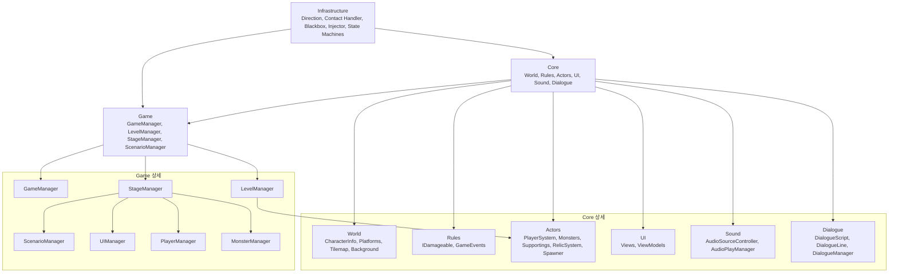

# 게임 구성

## 1. 구성 안내

본 문서는 현재 실제 구현에 맞춰 게임을 세 계층으로 정리한다.
`World Manager`, `Actor Manager` 같은 이름은 개념적 역할명이며, 실제 코드에서는 더 구체적인 매니저 클래스로 나뉘어 있다.

### 1. Infrastructure: 게임 로직을 지지하는 공용 도구와 외부 패키지

- Direction: 방향 정보
- Contact Handler: 트리거/충돌 처리 도구
- Blackbox: 패키지 기반 로그 추적 도구
- Injector: DI 주입기
- Input/Event/Standalone: 입력, 이벤트, 독립 업데이트 보조 도구
- State Machines: 상태 기계 프레임워크 (FSM, BT, SCP)

### 2. Core: 실제 게임 세상, 규칙, 객체, 표현을 구현한 부분

- World: 세계 정의
	- Background
	- Tilemap
	- Platforms
	- Character Info
- Rules: 게임 규칙
	- IDamageable
	- GameEvents
- Actors: 게임 객체
	- Player System
	- Monsters
	- Supportings
	- Relic System
	- Spawner
- UI: View, ViewModel, 화면별 UI
- Sound: AudioSourceController, BGM/SFX 재생기
- Dialogue: DialogueScript, DialogueLine, DialogueManager

### 3. Game: 씬과 게임 진행을 조율하는 운영 계층

- Game Manager
- Level Manager
- Stage Manager
- Scenario Manager
- UI Manager
- Player Manager
- Monster Manager
- Sound Manager

---

## 2. Infrastructure

Infrastructure는 특정 스테이지나 캐릭터 규칙을 직접 소유하지 않고, 여러 시스템이 함께 사용하는 기반 기능을 제공한다.

- `Direction`: 좌우 방향과 벡터 변환을 표현한다.
- `TriggerContactHandler`, `TryGetPlatform`: 충돌, 트리거, 타일맵 탐색 같은 월드 상호작용을 보조한다.
- `Blackbox`: `Packages/manifest.json`에 등록된 `com.blackthunder.blackboxsystem` 패키지이다. 게임 코드 내부 구현물이 아니라 외부 패키지 의존성으로 보는 편이 맞다.
- `Injector`, `IInjectable<T>`: 씬 로드 후 필요한 서비스와 라이브러리를 주입한다. `GameManager`가 씬의 `Injector`를 찾아 `GameServices`와 추가 주입 객체를 등록한다.
- `InputHub`, `EventHub`, `StandaloneBehaviourManager`: 입력 계층, 이벤트 전달, 독립 업데이트를 지원한다.
- `StateMachines`: 몬스터 행동, 시나리오 진행, 시퀀스 실행 등에 쓰이는 FSM, BT, SCP 구현을 둔다.

---

## 3. Core

Core는 게임 세계를 구성하는 데이터와 실제 동작을 담는다.

### World

- `Character`, `CharacterInfoSO`: 캐릭터 식별자와 대화/표시에 필요한 캐릭터 정보를 제공한다.
- `PlatformManager`, `PlatformDetector`: 타일맵 기반 플랫폼 정보를 수집하고, 플레이어/몬스터가 현재 플랫폼을 판단할 수 있게 한다.
- `CameraFollow`, `CameraMove`, `CameraFollowForLarge`: 씬에서 카메라 동작을 담당한다.
- `BoxDetector`, `PortalDetector`: 월드 오브젝트와의 감지 지점을 제공한다.
- `Game/Background`의 `ParallaxBackground`, `ParallaxCamera`, `ParallaxLayer`: 배경과 시차 표현을 담당하는 계층이다.

### Rules

- `IDamageable`: 피해를 받을 수 있는 대상의 공통 인터페이스이다.
- `GameEvents`: 몬스터 사망 같은 전역 게임 이벤트를 전달한다.

### Actors

- `PlayerSystem`: 플레이어 본체, 입력 처리, 상태, 이동, 공격, 스킬, 체력, 투사체를 포함한다.
- `Monsters`: 일반 몬스터와 보스, 몬스터 행동 BT, 공격 액션, 무기, 투사체, 스탯을 포함한다.
- `Supportings`: `Rubiel`, `TargetFollower`처럼 플레이어/시나리오를 보조하는 액터를 둔다. 이전 구조에서 `Units`로 묶었던 역할은 현재 코드에서는 별도 폴더가 아니라 이 역할군에 가깝다.
- `RelicSystem`: 유물, 상자, 포션, 유물 획득 처리를 담당한다.
- `Spawner`: `SpawnManager`, `MonsterSpawner`, 스폰 데이터로 웨이브와 몬스터 생성을 관리한다.

### UI, Sound, Dialogue

- `UI`: `IView`, `IViewModel`, `Views`, `ViewModels`로 화면 표시와 데이터 표현을 나눈다. 실제 런타임 연결은 `Game.Stage.UIManager`가 담당한다.
- `Sound`: `AudioSourceController`, `AudioPlayManager`, `BgmPlayManager`, `SfxPlayManager`, `UIButtonAudioPlayer`로 오디오 재생 단위를 나눈다.
- `Dialogue`: `DialogueScriptSO`, `DialogueLine`, `DialogueScriptLibrary`, `DialogueManager`로 대화 데이터와 재생 흐름을 관리한다.

---

## 4. Game

Game 계층은 Core의 객체들을 씬 안에서 찾아 연결하고, 게임 진행 상태와 씬 전환을 조율한다.

- `GameManager`: 모든 씬에 걸쳐 유지되는 단일 서비스이다. `GameServices` 구현체로서 BGM/SFX 설정, 플레이어 이름, 시나리오 최초 도달 여부, 씬 전환, 종료 처리를 담당한다. 씬 로드 시 `StageManager`, `ScenarioManager`, `Injector`를 찾아 초기화한다.
- `LevelManager`: 현재 스테이지, 탐험 횟수, 플레이어 사망 상태, 다음 씬 선택을 관리한다. 씬마다 배치된 `SpawnManager` 설정을 현재 런타임 매니저에 다시 묶는다.
- `StageManager`: 한 스테이지 씬의 중심 조립자이다. `Injector`, `InputHub`, `UIManager`, `PlayerManager`, `MonsterManager`를 요구하고, 플레이어/몬스터 등록, UI 연결, 대화 초기화, 입력 계층 등록, 사망 처리, 화면 페이드 등을 수행한다.
- `ScenarioManager`: 스테이지별 시나리오 블록을 상태 기계로 실행한다. 입력 차단, 루비엘 연출, 최초 도달 판정, 대화 흐름과 연결된다.
- `UIManager`: 런타임에 생성되거나 연결된 ViewModel과 View를 Canvas 또는 World UI 아래에 배치한다.
- `PlayerManager`, `MonsterManager`: 개념적 `Actor Manager` 역할을 실제로 나누어 맡는다. 플레이어는 단일 등록 객체로 관리하고, 몬스터는 집합으로 등록/해제한다.
- `Game.Management.SoundManager`: 전역 BGM/SFX 볼륨 설정을 보관하고 `GameServices`를 통해 UI와 오디오 재생기에서 사용한다.

정리하면 `World Manager`/`Actor Manager`는 현재 코드에 별도 클래스로 존재하지 않는다. 실제 구현에서는 `StageManager`가 씬 조립을 맡고, `LevelManager`, `PlayerManager`, `MonsterManager`, `SpawnManager`가 월드 진행과 액터 관리를 분담한다.
