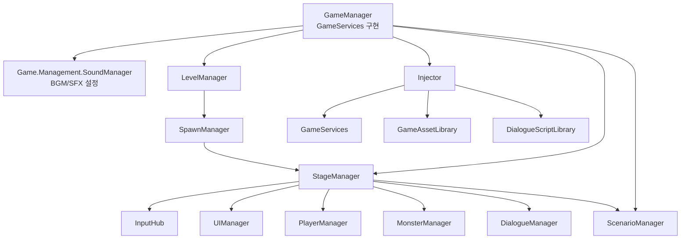
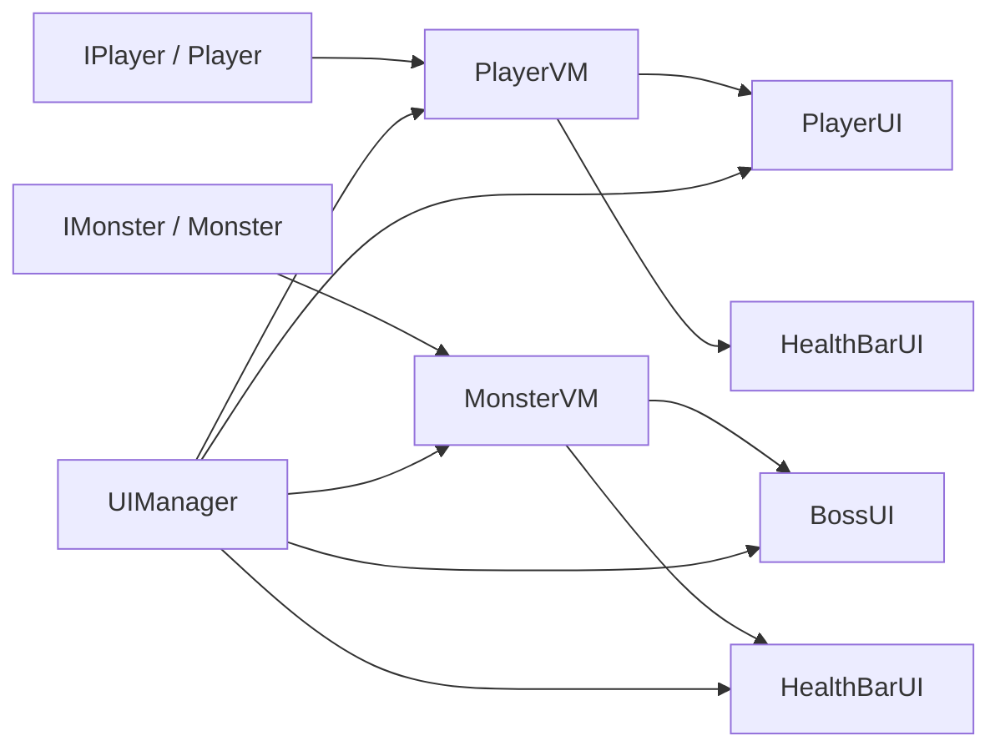

# 구현

## 1. 문서 범위

이 문서는 현재 실제 코드 기준으로 구현 흐름을 정리한다.
이전 구조의 `GameContext`는 현재 `GameServices` 추상 서비스로 대체되어 있고, `IControllable` 흐름은 `IInputLayerSubject`/`IInputLayerController`와 `InputHub` 중심으로 정리되어 있다.

현재 구현의 핵심 축은 다음과 같다.

1. `GameManager`: 전체 게임 서비스와 씬 전환을 담당한다.
2. `StageManager`: 씬 안의 플레이어, 몬스터, UI, 입력, 대화 객체를 조립한다.
3. `LevelManager`: 스테이지 진행, 사망 상태, 씬별 `SpawnManager` 설정을 관리한다.
4. `UIManager`: ViewModel과 View의 생명주기 및 부모 배치를 관리한다.
5. `InputHub`: 입력 주체의 우선순위를 평가해 현재 입력 가능 대상을 결정한다.

---

## 2. 초기화와 씬 로드 흐름

### GameManager

`GameManager`는 모든 씬에 걸쳐 유지되는 단일 객체이며 `GameServices`를 구현한다.
내부의 `Game.Management.SoundManager`로 BGM/SFX 볼륨 이벤트를 전달하고, 게임 진행 상태와 씬 전환 API를 외부에 제공한다.

- `Awake`: 중복 인스턴스를 제거하고 `DontDestroyOnLoad`로 유지한다. 자식에서 전역 `SoundManager`를 찾고 `SceneManager.sceneLoaded`에 연결한다.
- `Start`: 최초 시작 시 플레이어 이름과 클리어/도달 상태를 초기화한다.
- `OnSceneLoaded`: 로드된 씬에서 `StageManager`, `ScenarioManager`, `Injector`를 찾는다.
- `Inject`: 씬의 `Injector`에 `GameServices`와 추가 주입 객체를 등록한 뒤 `Inject()`를 실행한다.
- `ChangeScene`: 플레이어 진행 상태 보존 여부를 처리한 뒤 Unity 씬을 로드한다.
- `Quit`: 에디터에서는 플레이 모드를 종료하고, 빌드에서는 애플리케이션을 종료한다.

### GameServices

`GameServices`는 전역 게임 기능을 직접 참조하지 않고 주입받기 위한 추상 서비스이다.
`BgmChanged`, `SfxChanged`, `SetBgmVolume`, `SetSfxVolume`, `SetPlayerName`, `ConsumeFirstScenarioArrival`, `ChangeScene`, `Quit` 같은 기능을 노출한다.
`ScenarioManager`, `BgmPlayManager`, `SfxPlayManager`, 설정 UI 같은 시스템은 이 추상 타입을 통해 전역 기능에 접근한다.

### Injector

`Injector`는 씬 로드 후 `IInjectable<T>` 구현체들을 찾아 필요한 객체를 주입한다.
`GameManager`가 자기 자신을 `GameServices` 타입으로 등록하고, 인스펙터에 지정된 추가 주입 객체들을 함께 등록하는 방식으로 동작한다.

---

## 3. Stage 조립 흐름

`StageManager`는 한 스테이지 씬의 중심 조립자이다.
`RequireComponent`로 `Injector`, `InputHub`, `UIManager`, `PlayerManager`, `MonsterManager`를 요구하며, 시작 시 씬의 객체들을 자동으로 찾아 묶는다.

### StageManager가 묶는 객체

- World: `Player`, `Rubiel`, `Box`, `Portal`, `PlatformManager`
- UI: `Canvas`, `PlayerUI`, `RelicAcquisitionUI`, `RelicInfoPanelUI`, `SettingsUI`, `DialogueUI`, `BubbleDialogueUI`, `GuideAndWorldRecordsUI`, `DarkscreenUI`
- Managers: `InputHub`, `UIManager`, `PlayerManager`, `MonsterManager`, `DialogueManager`, `SfxPlayManager`
- Inputs: 플레이어, 플레이어 UI, 설정/유물/기록 UI 오프너, 추가 입력 컨트롤러

### Player 등록

`StageManager.Register(IPlayer, connectUI)`는 플레이어를 `PlayerManager`에 등록하고, UI 연결이 필요하면 `PlayerVM`을 만든다.
생성된 `PlayerVM`은 `UIManager.RegisterVM`에 등록되고, `PlayerUI.Connect(PlayerVM)`을 통해 체력, 스킬, 유물 HUD와 연결된다.
플레이어 사망 조건이 발생하면 `StageManager.PlayerDied` 이벤트가 발생하고, `GameManager`는 이를 받아 재시작 또는 기록 해금 씬으로 전환한다.

### Monster 등록

`StageManager.Register(IMonster, createUI)`는 몬스터를 `MonsterManager`에 등록한다.
UI가 필요하면 `MonsterVM`을 만들고, 보스 여부에 따라 `BossUI` 또는 월드 UI용 `HealthBarUI`를 생성/연결한다.
몬스터 생성은 기존 씬 배치 몬스터 자동 바인딩과 `SpawnManager.OnMonsterCreate` 콜백을 통해 들어온다.

### 정리

씬이 파괴될 때 `StageManager.OnDestroy`는 `UIManager`, `PlayerManager`, `MonsterManager`의 `Destroy()`를 호출한다.
이 구조 때문에 View/ViewModel/Actor는 각자 이벤트 구독을 해제하고 생명주기 이벤트를 발생시켜야 한다.

---

## 4. Level과 Spawn

### LevelManager

`LevelManager`는 `DontDestroyOnLoad`로 유지되는 스테이지 진행 관리자이다.
현재 스테이지 번호, 탐험 횟수, 플레이어 사망 상태, 다음 씬 선택을 관리한다.

- `RebindSpawnManagerForScene`: 씬이 로드될 때 씬 안의 `SpawnManager` 설정을 현재 런타임 `SpawnManager`에 반영한다.
- `ResetState`: 유물, 스킬 로드아웃, 플레이어 진행 상태, 탐험 카운터를 초기화한다.
- `MoveNextLevel`: 일반 맵, 보스 맵, 다음 스테이지 타입에 따라 다음 씬 이름을 결정한다.
- `LoadNextScene`: 플레이어 진행 상태를 저장하고 씬을 로드한다.

### SpawnManager

`SpawnManager`는 여러 `MonsterSpawner`의 완료 상태를 모아 스테이지 클리어 오브젝트를 활성화한다.

- `AddSpawner`: 스포너를 등록하고 몬스터 생성 콜백을 전달한다.
- `OnMonsterCreate`: 생성된 몬스터를 `StageManager`가 등록할 수 있도록 콜백을 저장한다.
- `CheckAllSpawnersComplete`: 모든 스포너가 완료되었는지 검사한다.
- `WaveComplete`: 특정 스포너 완료 후 연결된 웨이브 오브젝트를 활성화한다.
- `RefreshClearObjectForLoadedScene`: 새 씬의 `ClearObjects` 참조를 다시 찾는다.

### MonsterSpawner

`MonsterSpawner`는 스폰 포인트와 페이즈 정보를 기준으로 몬스터를 생성한다.
생성한 몬스터는 `monsterCreated` 콜백을 통해 `SpawnManager`와 `StageManager` 흐름으로 전달된다.
현재 구현에서는 라지맵/소형맵 웨이브, 강화된 최종 소형맵 페이즈, 티어 업그레이드 매핑을 함께 처리한다.

---

## 5. UI와 ViewModel

UI 계층은 `IViewModel`과 `IView`를 중심으로 분리되어 있다.
ViewModel은 Actor의 상태와 이벤트를 UI 친화적인 데이터로 바꾸고, View는 그 데이터를 화면에 표시한다.

### UIManager

`UIManager`는 등록된 `IViewModel`과 `IView`를 보관한다.
View는 일반 Canvas 또는 World UI 부모 아래에 배치할 수 있다.
View 또는 ViewModel이 파괴/Dispose되면 등록 목록에서 제거되며, `UIManager.Destroy()` 시 등록된 View와 ViewModel을 정리한다.

### PlayerVM / PlayerUI

`PlayerVM`은 `IPlayer`를 감싸서 체력, 스킬 목록, 선택 스킬, 쿨타임, 스킬 룰렛 이벤트를 제공한다.
`PlayerUI`는 `PlayerVM`에 연결되어 스킬 UI, 궁극기 UI, 체력바, 유물 HUD를 갱신한다.
스킬 선택은 `PlayerUI`의 입력 처리에서 `PlayerVM.ChangeSkill()`로 이어지고, 스킬 룰렛 버튼은 `PlayerVM.TrySkillRoulette()`를 통해 적용된다.

### MonsterVM / BossUI / HealthBarUI

`MonsterVM`은 `IMonster`의 위치, 하단 위치, 체력 비율, 사망 이벤트를 제공한다.
일반 몬스터는 월드 UI용 `HealthBarUI`와 연결되고, 보스는 `BossUI`에 연결된다.
`BossUI`는 내부 `HealthBarUI`를 사용하며, `MonsterVM.Dead`를 받으면 비활성화 후 파괴할 수 있다.

### HealthBarUI

`HealthBarUI`는 `IHealthRateVM`의 `HealthRateChanged`와 `Disposed` 이벤트를 구독한다.
연결 시 즉시 현재 체력 비율을 반영하고, 연결 해제 시 이벤트 구독을 제거한다.

---

## 6. Dialogue

대화 시스템은 데이터, 라이브러리, 매니저, 표시 UI로 나뉜다.

- `DialogueScriptSO`: 제목, 표시 스타일, 대사 목록을 가진 ScriptableObject이다.
- `DialogueLine`: 캐릭터, 이름/초상화/대사 오버라이드를 담는 한 줄 데이터이다.
- `DialogueScriptLibrary`: 제목으로 `DialogueScriptSO`를 찾는다.
- `DialogueManager`: 대화 재생 흐름을 관리한다.
- `DialogueUI`: 일반 대화창을 표시한다.
- `BubbleDialogueUI`: 말풍선 스타일 대화를 표시한다.

`DialogueManager`는 `GameAssetLibrary`와 `DialogueScriptLibrary`를 주입받는다.
`Play(title)` 호출 시 제목으로 스크립트를 찾고, `DialogueStyle.ChatBubble` 여부에 따라 `BubbleDialogueUI` 또는 `DialogueUI`를 선택한다.
일반 대화 UI는 `DialogueLine`에서 캐릭터 정보를 찾고 `{player}` 플레이스홀더를 현재 플레이어 이름으로 치환한다.
말풍선 대화는 캐릭터 위치를 `StageManager`가 넘긴 위치 조회 함수로 얻어 화면상 위치를 계산한다.

---

## 7. Sound

사운드 구현은 전역 설정과 실제 재생기를 분리한다.

### 전역 볼륨

`Game.Management.SoundManager`는 BGM/SFX 볼륨 값을 보관하고 `BgmChanged`, `SfxChanged` 이벤트를 발행한다.
`GameManager`는 `GameServices`를 통해 이 값을 외부에 노출한다.

### BGM

`BgmPlayManager`는 `GameServices`를 주입받아 BGM 볼륨 이벤트를 구독한다.
정적 `Play(BgmName)`/`Stop()` API를 제공하며, 새 BGM 재생 시 페이드 아웃/인으로 교체한다.

### SFX

`SfxPlayManager`는 `AudioPlayManager<SfxName>`를 상속한다.
`GameServices.SfxChanged`를 구독해 볼륨을 반영하고, `Play(SfxName)`로 등록된 효과음을 재생한다.

### 개별 AudioSource

`AudioSourceController`는 문자열 이름 기반 오디오 재생을 지원한다.
`PlayOption`으로 루프, 독립 재생, 원샷 재생을 나누고, 필요하면 페이드 아웃을 예약한다.
`SfxAudioController`는 전역 SFX 볼륨에 `VolumeRate`를 곱해 개별 효과음 볼륨을 맞춘다.
`UIButtonAudioPlayer`는 `AudioPlayer<SfxName, SfxPlayManager>`를 통해 버튼 Hover/Click 효과음을 재생한다.

---

## 8. Actors

### IPlayer / Player

`IPlayer`는 플레이어가 외부에 제공하는 상태와 조작 인터페이스이다.
체력, 생존 여부, 플랫폼, 방향, 스킬 목록, 선택 스킬, 쿨타임, 스킬 룰렛 상태를 노출한다.
`Player` 구현체는 `PlatformManager`를 주입받아 `PlatformDetector`에 연결하고, 매 프레임 현재 플랫폼을 갱신한다.
체력/스킬/룰렛 변경은 `ConditionChanged`, `SkillAdded`, `SkillChanged`, `SkillRouletteApplied`, `SkillRouletteCleared` 이벤트로 UI에 전달된다.

### IMonster / Monster

`IMonster`는 몬스터의 체력, 방향, 생존 여부, 현재 플랫폼, 상태 이벤트, 파괴 이벤트를 외부에 제공한다.
몬스터는 `GameAssetLibrary`, `Configuration`, `PlatformManager`를 주입받아 초기화된다.
피해 처리는 `MonsterDamageReceiver`가 `IDamageable`을 구현하고, `Damaged` 이벤트를 몬스터 본체가 받아 HP와 상태 이벤트를 갱신하는 구조이다.
사망 시 `Destroyed` 이벤트와 `GameEvents.NotifyMonsterDied()`가 발생한다.

### IBoss

`IBoss`는 `IMonster`에 보스 전용 시작 메서드 `Commence()`와 보스 오디오 플레이어 접근을 추가한다.
`IPlayerInitializable`을 구현한 보스는 시작 시 플레이어 참조를 별도로 받을 수 있다.

### IndicatorHub

`IndicatorHub`는 몬스터의 내부 상태와 설정을 사용해 플레이어 감지, 느낌표, 텍스트 같은 인디케이터를 표시한다.
인디케이터 프리팹과 재질은 `GameAssetLibrary`에서 공급받는다.

---

## 9. Relic

유물 시스템에는 게임 로직용 `Actors.RelicSystem.RelicManager`와 HUD 표시용 `UI.Views.PlayerView.RelicManager`가 둘 다 존재한다.
문서에서 `RelicManager`를 언급할 때는 네임스페이스를 함께 확인해야 한다.

### Actors.RelicSystem.RelicManager

게임 로직용 `RelicManager`는 싱글턴이며 소유 유물을 `Dictionary<int, List<GameObject>>`로 관리한다.
유물 후보 추첨, 동전 강화 판정, 유물 추가/제거, 유물 효과 적용, 유물 획득 UI 이벤트 발행을 담당한다.

- `RelicAcquiring`: 유물 획득 UI를 열기 위한 DTO 이벤트이다.
- `RelicAcquired`: 유물이 실제로 추가된 뒤 발생한다.
- `GetRandomRelicData`: 후보군과 가중치로 유물 데이터를 선택한다.
- `StartCoinRandom`: 동전 강화 성공 여부를 결정한다.
- `AddRelic`: 유물 프리팹을 생성하고 효과를 적용한다.
- `ClearAllOwnedRelics`: 재시작/상태 초기화 시 모든 소유 유물을 제거한다.

### RelicAcquisitionUI

`RelicAcquisitionUI`는 `RelicManager.Instance.RelicAcquiring`을 구독한다.
획득 후보를 표시하고, 동전 던지기 버튼을 누르면 `StartCoinRandom` 결과에 따라 영상/효과를 재생한 뒤 `AddRelic`을 호출한다.
닫기 시 다크스크린을 해제하고 타이머와 영상 상태를 정리한다.

### UI.Views.PlayerView.RelicManager

HUD용 `RelicManager`는 플레이어 UI 안에서 유물 아이콘을 생성하고 배치하는 컴포넌트이다.
게임 로직용 유물 보관소가 아니며, `RelicDataSO`를 받아 `RelicUI`를 초기화한다.

---

## 10. World와 데이터 라이브러리

### PlatformManager

`PlatformManager`는 씬의 Tilemap들을 읽어 수평으로 이어진 타일 묶음을 플랫폼 ID로 등록한다.
`TryGetPlatformId(Vector2, out int)`와 `GetPlatformId`로 월드 위치가 어느 플랫폼에 속하는지 알려 준다.
`PlatformDetector`는 캐릭터 하단 주변을 샘플링해 현재 플랫폼을 찾고, 플레이어와 몬스터는 이 값을 이동/상태 판단에 사용한다.

### GameAssetLibrary

`GameAssetLibrary`는 여러 시스템이 공유하는 에셋 접근점이다.
플레이어 감지 표시, 느낌표, 텍스트 인디케이터, 단색 재질, 캐릭터 정보 배열을 보관한다.
`TryGetCharacterInfo(Character, out CharacterInfoSO)`는 대화 UI와 `GameManager`의 플레이어 이름 설정에서 사용된다.

---

## 11. InputHub

`InputHub`는 입력을 받을 수 있는 주체들을 순서 있는 목록으로 관리한다.

- `Add`, `AddAfter`: 입력 주체를 등록한다.
- `Remove`: 입력 주체를 제거한다.
- `Block`, `Unblock`: 임시 입력 차단용 `EmptyInputSubject`를 넣거나 제거한다.
- `EvaluateInputState`: 뒤쪽 주체부터 평가해, 트리거가 아닌 주체가 나오면 그 앞의 주체 입력을 막는다.

입력 주체는 `IInputLayerSubject`를 구현해야 한다.
`AllowInput`은 현재 입력 가능 여부이고, `IsTrigger`는 입력을 받더라도 뒤쪽 주체를 막지 않는 UI/단축 입력인지 나타낸다.
입력 컨트롤러는 `IInputLayerController.Initialize(IInputHub)`로 허브 참조를 받는다.
